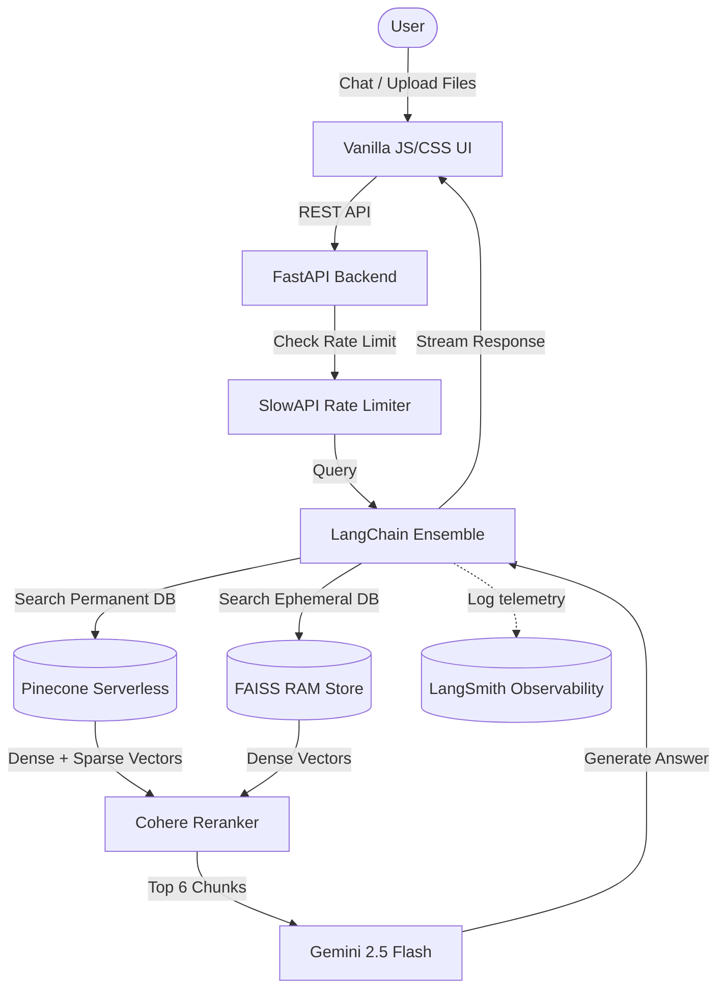

# Comparative RAG Portfolio Agent

An advanced, cloud-native Retrieval-Augmented Generation (RAG) system designed to act as an interactive professional portfolio. 

Instead of a standard Q&A bot, this agent utilizes a **Split-Brain Memory Architecture** (Pinecone + FAISS) and a **LangChain Ensemble Retriever**. It allows recruiters to upload a Job Description (JD) and dynamically cross-references their exact requirements against my historical projects, resume, and technical documentation.

---

## 🏗️ Architecture Overview

The system is built on a highly optimized, four-pillar RAG pipeline deployed via a modern FastAPI backend:



### 1. Dual-Memory Retrieval (Split-Brain):
* **Long-Term Memory:** Pinecone Serverless acts as the permanent knowledge base containing my professional history (experience, deployed projects, etc.).
* **Short-Term Memory:** An ephemeral FAISS vector store sits in RAM to process user-uploaded files (JDs), deleting them securely the moment the session ends.

### 2. Cloud-Native Hybrid Search:
* **Dense Vectors (Gemini 2.0 Multimodal):** Captures semantic meaning and conceptual alignment.
* **Sparse Vectors (Pinecone Inference):** Captures exact keyword dominance (BM25 equivalent) via a custom `CloudSparseEncoder` wrapper, bypassing local dependencies.

### 3. Contextual Compression (SOTA Filtering):
* A **Cohere Cross-Encoder** intercepts the retrieved chunks from both databases, reads them simultaneously against the user's prompt, and aggressively filters out noise, passing only the top 6 most mathematically relevant chunks to the generator.

### 4. The Generative Brain:
* Powered by **Gemini 2.5 Flash**, the final generation step is locked behind strict system prompts designed to prevent hallucination, enforce professional tone, and block the leakage of Personally Identifiable Information (PII).

---

## 🛠️ Tech Stack

| Component | Technology | Purpose |
| :--- | :--- | :--- |
| **Frontend UI** | Vanilla HTML/CSS/JS | Glassmorphic, zero-dependency blazing fast UI |
| **Backend API** | FastAPI | Highly concurrent asynchronous REST server |
| **Rate Limiting** | SlowAPI | Protects endpoints from abuse/spam |
| **Orchestration** | LangChain | Ensemble logic, routing, and chain construction |
| **LLM (Brain)** | Gemini 2.5 Flash | Blazing fast, highly factual response synthesis |
| **Embeddings** | Gemini 2.0 Preview | 768-dimensional semantic text mapping |
| **Permanent DB** | Pinecone Serverless | Hybrid (Dense + Sparse) cloud vector storage |
| **Ephemeral DB** | FAISS (CPU) | High-speed, in-memory RAM vector storage |
| **Reranker** | Cohere v3.0 | Cross-encoder contextual compression |
| **Observability** | LangSmith | Traces LLM calls for latency and cost analysis |
| **Deployment** | Docker & GitHub Actions | Automated CI/CD pipeline targeting AWS EC2 |

---

## 📂 Project Structure

```text
rag-portfolio-v2/
├── .github/workflows/         # CI/CD Pipelines (deploy & test)
├── static/                    # Frontend UI (index.html, style.css, script.js)
├── src/
│   ├── agent.py               # Ensemble logic, Cohere filtering, & Gemini chains
│   ├── vector_store.py        # Database routing & custom CloudSparseEncoder
│   └── document_loaders.py    # Factory line for PDF, DOCX, and TXT chunking
├── tests/                     # Pytest suite
├── main.py                    # FastAPI server & SlowAPI Rate Limiting
├── Dockerfile                 # Production Docker image configuration
└── requirements.txt           # Production dependencies
```

---

## 🚀 Local Development

1. **Clone & Environment:**
   ```bash
   git clone https://github.com/kalpit-22/rag-portfolio-v2.git
   cd rag-portfolio-v2
   python3 -m venv venv
   source venv/bin/activate
   pip install -r requirements.txt
   ```

2. **API Keys:**
   Copy `.env.example` to `.env` and fill in your Gemini, Cohere, Pinecone, and LangSmith keys.

3. **Run the API:**
   ```bash
   uvicorn main:app --reload
   ```
   *Navigate to `http://localhost:8000` to interact with the UI.*

4. **Run Tests:**
   ```bash
   python -m pytest tests/ -v
   ```
