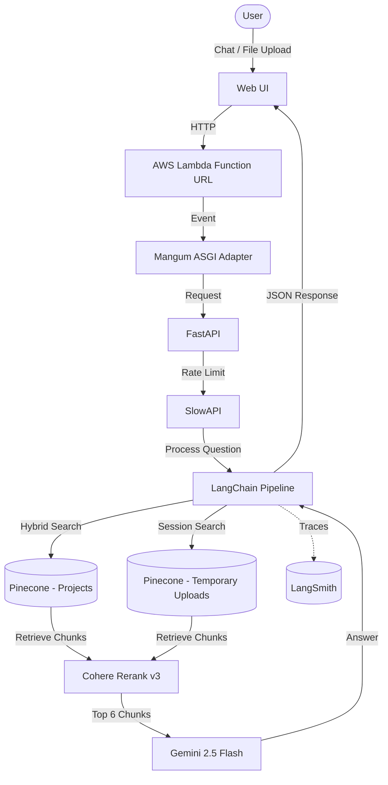

# Adaptive RAG Engine

An interactive AI agent built with FastAPI, LangChain, and Pinecone. 

This agent combines a permanent knowledge base of my background with dynamic, session-based document ingestion. Visitors can ask questions about my experience and projects, or upload custom documents (PDF, DOCX, TXT) that are chunked, embedded, and queried in real time alongside my portfolio data.

---

## How It Works

Here is the high-level architecture of how requests flow from the frontend to the LLM:



### Key Technical Details

1. **Dual-Memory Search:**
   - **Permanent Memory:** Pinecone index containing vectors of my resume, project writeups, and documentation.
   - **Ephemeral Session Memory:** When a user uploads a document, its text is chunked, converted into vector embeddings, and indexed into a temporary Pinecone namespace tied to their session ID. This allows real-time querying across both the permanent portfolio and the newly uploaded document context.

2. **Hybrid Search (Dense + Sparse):**
   - Combines semantic search (Gemini 2.0 Embeddings) with keyword matching (Pinecone Sparse Encoder) so it can handle both conceptual questions and specific keyword queries.

3. **Reranking & Filtering:**
   - Results from both vector sources pass through Cohere Rerank v3 to score and pick the top 6 most relevant text chunks before building the prompt.

4. **Response Generation:**
   - Uses Gemini 2.5 Flash with system instructions to stick strictly to the retrieved context and prevent disclosing private contact info.

5. **Serverless Infrastructure:**
   - Packaged into a Docker container (`linux/amd64`) and deployed to AWS Lambda using Mangum (ASGI adapter) and Function URLs.

---

## Tech Stack

- **Backend:** Python 3.12, FastAPI, Mangum, SlowAPI
- **LLM & Embeddings:** Google Gemini 2.5 Flash, Gemini 2.0 Embeddings
- **Vector DB & Reranking:** Pinecone (Serverless), Cohere Rerank v3
- **Orchestration:** LangChain
- **Observability:** LangSmith
- **DevOps / Infra:** Docker, AWS Lambda, AWS ECR, GitHub Actions (CI/CD)

---

## Project Structure

```text
adaptive-rag-engine/
├── .github/workflows/
│   ├── deploy.yml          # CI/CD: Builds Docker image, pushes to ECR, updates Lambda
│   └── test.yml            # CI/CD: Runs pytest with mocked APIs
├── static/                 # HTML/CSS/JS frontend
├── src/
│   ├── agent.py            # LangChain chain logic, prompt templates, reranking
│   ├── vector_store.py     # Pinecone connection setup and custom sparse encoder
│   ├── document_loaders.py # PDF/DOCX/TXT file parsing & text splitting
│   └── ingest.py           # Script to process & upload my project files to Pinecone
├── tests/
│   └── test_api.py         # Pytest suite (mocking Gemini & Pinecone calls)
├── Dockerfile              # Production Docker image (AWS Lambda Python base)
├── main.py                 # FastAPI endpoints & rate-limiting configuration
└── requirements.txt        # Python dependencies
```

---

## Running Locally

### 1. Setup Environment
```bash
git clone https://github.com/kalpit-22/adaptive-rag-engine.git
cd adaptive-rag-engine
python3 -m venv venv
source venv/bin/activate
pip install -r requirements.txt
```

### 2. Configure Environment Variables
Create a `.env` file in the root directory:
```env
GOOGLE_API_KEY=your_gemini_api_key
COHERE_API_KEY=your_cohere_api_key
PINECONE_API_KEY=your_pinecone_api_key
LANGCHAIN_TRACING_V2=true
LANGCHAIN_API_KEY=your_langsmith_api_key
```

### 3. Ingest Portfolio Data (Optional)
If you want to re-index the project files in `src/my_projects`:
```bash
python -m src.ingest
```

### 4. Start the Local Server
```bash
uvicorn main:app --reload
```
Open `http://localhost:8000` in your browser.

### 5. Run Tests
```bash
python -m pytest tests/ -v
```

---

## CI/CD Pipeline

Every push to `main` triggers a GitHub Actions workflow:
1. **Test Phase:** Runs `pytest` with mocked LLM/Vector DB responses to verify endpoint logic.
2. **Build Phase:** Builds the Docker container for `linux/amd64` (`--provenance=false`).
3. **Deploy Phase:** Authenticates with AWS, pushes the image to Amazon ECR, and updates the AWS Lambda function code automatically.
